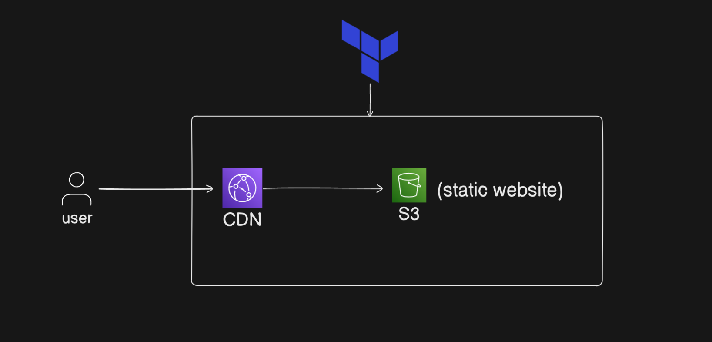

# **Deploy a Static Website on AWS S3 + CloudFront**

## **Overview**
This beginner-friendly guide will teach you how to deploy a static website on AWS using Terraform. You'll learn the fundamentals of Infrastructure as Code (IaC) while building a production-ready setup with S3 for hosting, CloudFront for global content delivery, and proper IAM permissions.

## **Prerequisites**
- AWS CLI installed and configured
- Terraform installed (version 1.0+)
- Basic understanding of AWS services
- A static website (HTML, CSS, JS files) to deploy

## **Architecture**

*The diagram illustrates the flow:*
- **S3 Bucket** hosts the static website files.
- **CloudFront** distributes content globally.
- **IAM Roles/Policies** secure access.
- **Users** access the website via CloudFront.

